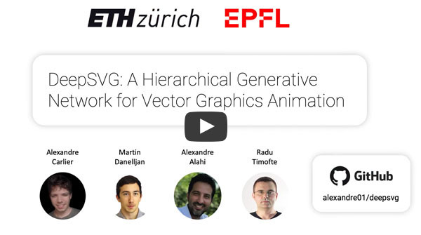
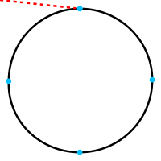
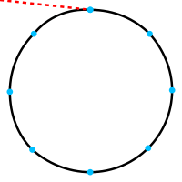
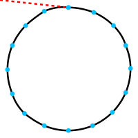
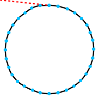

<p align="center">
    <a href="https://github.com/alexandre01/deepsvg">
        
    </a>
    <a href="https://github.com/alexandre01/deepsvg/blob/master/LICENCE">
        
    </a>
    <a href="https://blog.alexandrecarlier.com/deepsvg/index.html">
        
    </a>
</p>

## Introduction
This is the official code for the paper "DeepSVG: A Hierarchical Generative Network for Vector Graphics Animation".
Please refer to section [below](#citation) for Citation details.

- Paper: [arXiv](https://arxiv.org/abs/2007.11301)
- Code: [GitHub](https://github.com/alexandre01/deepsvg)
- Project page: [link](https://alexandre01.github.io/deepsvg)
- 1min video:

[](https://youtu.be/w9Bu4u-SsKQ)


------------------------------------------------------------------------------------------------------------------------


This repository includes:
- The **training code** to reproduce our Hierarchical Generative Network: DeepSVG.
- A **library for deep learning with SVG data**, including export functionality to differentiable PyTorch tensors.
- The **SVG-Icons8 dataset**.
- A **Graphical user interface** showing a demo of DeepSVG for vector graphics animation. 


## Updates
- December 2020: Added raw SVG dataloader (see [Dataloader](#dataloader) section).

- September 2020: Accepted to NeurIPS2020 🎉

- July 2020: Added pretrained models and notebook for Font generation. 


## Installation

Start by cloning this Git repository:
```
git clone https://github.com/alexandre01/deepsvg.git
cd deepsvg
```

Create a new [conda](https://docs.conda.io/en/latest/miniconda.html) environment (Python 3.7):
```
conda create -n deepsvg python=3.7
conda activate deepsvg
```

And install the dependencies:
```
pip install -r requirements.txt
```

Please refer to [cairosvg](https://cairosvg.org/documentation/#installation)'s documentation for additional requirements of CairoSVG.
For example:
- on Ubuntu: `sudo apt-get install libcairo2-dev`.
- on macOS: `brew install cairo libffi`.

## Tested environments
- Ubuntu 18.04, CUDA 10.1
- macOS 10.13.6, CUDA 10.1, PyTorch installed from source


## Dataset

Download the dataset using the script provided in `dataset/` by running:
```
cd dataset/
bash download.sh
```

If this is not working for you, download the dataset manually from Google Drive, place the files in the `dataset` folder, and unzip (this may take a few minutes).
- `icons_meta.csv` (9 MB): https://drive.google.com/file/d/10Zx4TB1-BEdWv1GbwcSUl2-uRFiqgUP1/view?usp=sharing
- `icons_tensor.zip` (3 GB): https://drive.google.com/file/d/1gTuO3k98u_Y1rvpSbJFbqgCf6AJi2qIA/view?usp=sharing

By default, the dataset will be saved with the following tree structure:
```
deepsvg
 └─dataset/
    ├── icons_meta.csv
    └── icons_tensor/
```

> **NOTE**: The `icons_tensor/` folder contains the 100k icons in pre-augmented PyTorch tensor format, which enables to easily reproduce our work.
For full flexbility and more research freedom, we however recommend downloading the original SVG icons from [icons8](https://icons8.com), for which you will need a paid plan.
Instructions to download the dataset from source are coming soon.

To download the Font-dataset, we recommend following SVG-VAE's instructions: https://github.com/magenta/magenta/tree/master/magenta/models/svg_vae.
For demo purposes, we also release a mini version of the dataset. To download it, run:
```
cd dataset/
bash download_fonts.sh
```

Or use these links:
- `fonts_meta.csv` (6 MB): https://drive.google.com/file/d/1PEukDlZ6IkEhh9XfTTMMtFOwdXOC3iKn/view?usp=sharing
- `fonts_tensor.zip` (92 MB): https://drive.google.com/file/d/15xPf2FrXaHZ0bf6htZzc9ORTMGHYz9DX/view?usp=sharing


## Dataloader
To process a custom dataset of SVGs, use the `SVGDataset` dataloader.
To preprocess them on the fly, you can set `already_preprocessed` to `False`, but we recommend preprocessing them before training for better I/O performance.

To do so, use the `dataset/preprocess.py` script:
```shell script
python -m dataset.preprocess --data_folder dataset/svgs/ --output_folder dataset/svgs_simplified/ --output_meta_file dataset/svg_meta.csv
```

This will preprocess all input svgs in a multi-threaded way and generate a meta data file, for easier training filtering.

Then modify the training configuration by providing the correct dataloader module, data folder and meta data file:

``` python
cfg.dataloader_module = "deepsvg.svg_dataset"
cfg.data_dir = "./dataset/svgs_simplified/"
cfg.meta_filepath = "./dataset/svg_meta.csv"
```

## Deep learning SVG library
DeepSVG has been developed along with a library for deep learning with SVG data. The main features are:
- Parsing of SVG files.
- Conversion of basic shapes and commands to the subset `m`/`l`/`c`/`z`.
- Path simplification, using Ramer-Douglas-Peucker and Philip J. Schneider algorithms.
- Data augmentation: translation, scaling, rotation of SVGs.
- Conversion to PyTorch tensor format.
- Draw utilities, including visualization of control points and exporting to GIF animations.

The notebook `notebooks/svglib.ipynb` provides a walk-trough of the `deepsvg.svglib` library. Here's a little sample code showing the flexibility of our library:
```python
from deepsvg.svglib.svg import SVG
from deepsvg.svglib.geom import Point, Angle

icon = SVG.load_svg("docs/imgs/dolphin.svg").normalize()
icon.simplify_heuristic()                                 # path simplifcation
icon.zoom(0.75).translate(Point(0, 5)).rotate(Angle(15))  # scale, translate, rotate
icon.draw()
```


And making a GIF of the SVG is as easy as:
```python
icon.animate()
```


### Differentiable SVG shape optimization
Similarly to [PyTorch3D](https://github.com/facebookresearch/pytorch3d), differentiable operations can be performed on a `SVGTensor`, enabling to deform a circle to match an arbitrary target via gradient descent.
Interestingly, using a lower number of Bézier commands in the initial circle (n) creates somehow artistic approximations of the target shape.
See `notebooks/svgtensor.ipynb`.

| n |     4       |        8       |        16       |         32      |
|---|-------------|----------------|-----------------|-----------------|
| optimization |||||


## Graphical User Interface (_experimental_)
While developing DeepSVG, we have also built a Graphical User Interface (GUI) for easier visualization of our model and as a tool to easily create 2D animations.
The code, available under `deepsvg/gui`, is written with Kivy and the UI style is inspired from the design tool Figma.

> **DISCLAIMER**: this GUI has been developed for demo purposes mainly and features one would expect from 
a vector graphics editor (like rescaling) will be added in the near future. For more flexibility, we recommend creating
animations programmatically using the template code provided in `notebooks/animation.ipynb`.


Shortcuts:
- `H`: hand tool
- `P`: pen tool
- `Ctrl/⌘ Cmd P`: pencil tool
- `K`: make keyframe
- `spacebar`: play/pause
- `Ctrl/⌘ Cmd E`: export animation to GIF (file is saved by default in `./gui_data`)

## Training

Start a training by running the following command.

```
python -m deepsvg.train --config-module configs.deepsvg.hierarchical_ordered
```

The (optional) `--log-dir` argument lets you choose the directory where model checkpoints and tensorboard logs will be saved.

## Inference (interpolations)

Download pretrained models by running:
```
cd pretrained/
bash download.sh
```

If this doesn't work, you can download them manually from Google Drive and place them in the `pretrained` folder.
- `hierarchical_ordered.pth.tar` (41 MB): https://drive.google.com/file/d/1tsVx_cnFunSf5vvPWPVTjZ84IQC2pIDm/view?usp=sharing
- `hierarchical_ordered_fonts.pth.tar` (41 MB): https://drive.google.com/file/d/11KBUWfexw3LDvSFOVxy072_VCFYKm3L-/view?usp=sharing


We provide sample code in `notebooks/interpolate.ipynb` to perform interpolation between pairs of SVG icons
and `notebooks/latent_ops.ipynb` for word2vec-like operations in the SVG latent space, as shown in the experiments of our paper.


## Notebooks

| Description                                  | Link to notebook                                     |
|----------------------------------------------|------------------------------------------------------|
| SVGLib walk-through                          | [svglib.ipynb](notebooks/svglib.ipynb)               |
| Differentiable SVGTensor optimization        | [svgtensor.ipynb](notebooks/svgtensor.ipynb)         |
| DeepSVG interpolation between pairs of icons | [interpolation.ipynb](notebooks/interpolation.ipynb) |
| DeepSVG latent space operations              | [latent_ops.ipynb](notebooks/latent_ops.ipynb)       |
| DeepSVG animation between user-drawn images  | [animation.ipynb](notebooks/animation.ipynb)         |
| DeepSVG generation and interpolation of Fonts| [fonts.ipynb](notebooks/fonts.ipynb)                 |

## Citation
If you find this code useful in your research, please cite:
```
@misc{carlier2020deepsvg,
    title={DeepSVG: A Hierarchical Generative Network for Vector Graphics Animation},
    author={Alexandre Carlier and Martin Danelljan and Alexandre Alahi and Radu Timofte},
    year={2020},
    eprint={2007.11301},
    archivePrefix={arXiv},
    primaryClass={cs.CV}
}
```


## Contributing
Contributions are welcome! Feel free to submit a pull request if you have found a bug or developed a feature that may be useful for others.
Also, don't hesitate to contact [me](https://github.com/alexandre01/) for any further question related to this code repository.


## Licence
This code is released under the [MIT licence](LICENCE).
