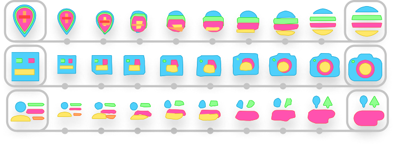
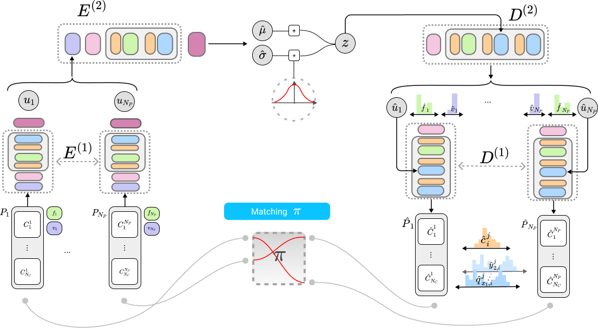
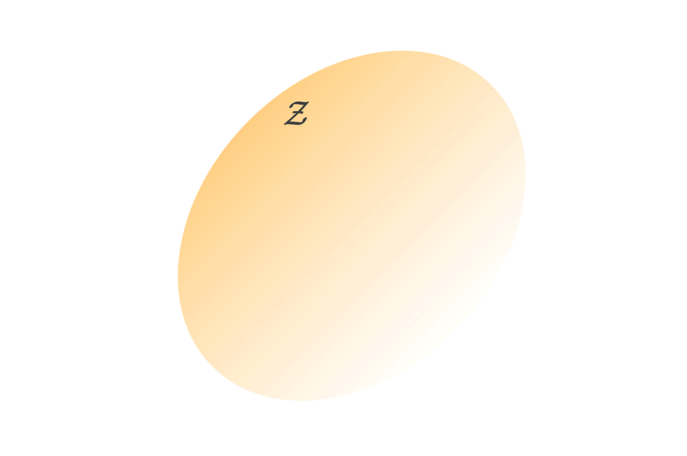
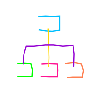
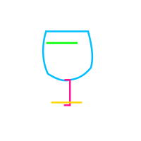
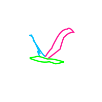
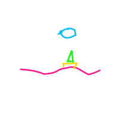
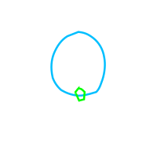
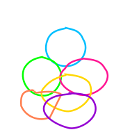
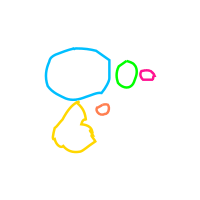

Paper: [arXiv](https://arxiv.org/abs/2007.11301) <br />
Code: [GitHub](https://github.com/alexandre01/deepsvg) <br />
Project page: [link](https://alexandre01.github.io/deepsvg)

## Introduction
Our model:


See [architecture.gif](imgs/architecture.gif) for an animated walk-through of our DeepSVG architecture.

## Demonstration


## Interpolations


- Betweeen a pair of icons:
<p align="center">
    
    
    
</p>


- Between two user-drawn frames:
<p align="center">
    
    
    
</p>


- Latent space algebra ("create" & "squarify"):
<p align="center">
    
    
    
</p>

## Citation
If you find this work useful in your research, please cite:
```
@misc{carlier2020deepsvg,
    title={DeepSVG: A Hierarchical Generative Network for Vector Graphics Animation},
    author={Alexandre Carlier and Martin Danelljan and Alexandre Alahi and Radu Timofte},
    year={2020},
    eprint={2007.11301},
    archivePrefix={arXiv},
    primaryClass={cs.CV}
}
```